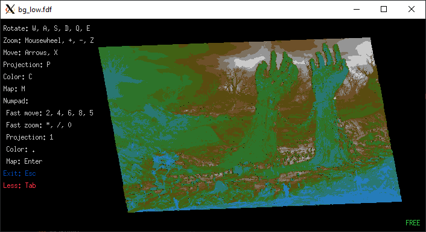
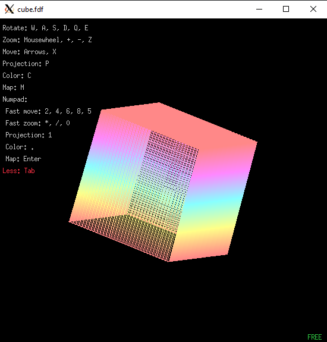
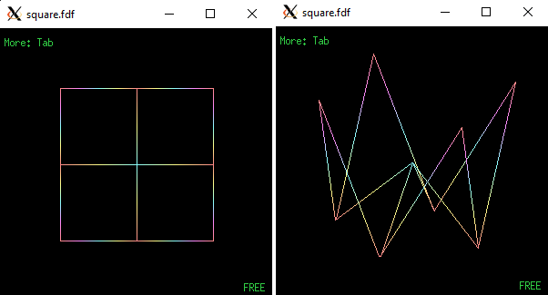
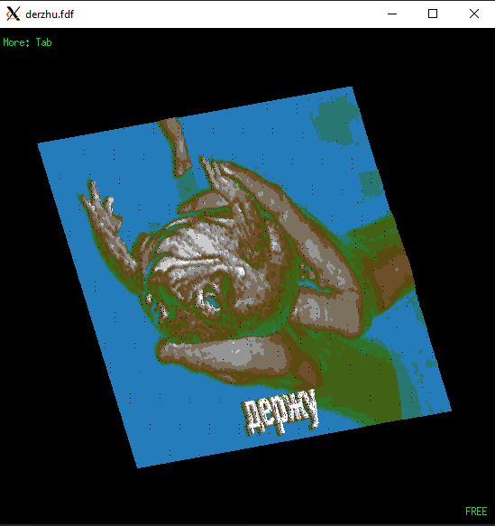

# FdF
# The first graphic project of the School 21



For more information about project read **fdf.en.pdf**.

## Preparing

To run this project you will need a **minilibx**.

### Sources for minilibx installation
#### for *Linux*
[Here](https://github.com/BinaryBenji/Minilibx_Installer) or [here](https://github.com/ttshivhula/minilibx).
#### for *Macos*
Try [this](https://github.com/pbondoer/MinilibX) or [this](https://github.com/dannywillems/minilibx-mac-osx).

## Compilation
### Makefile
For Macos users change first string in **Makefile** to:
```javascript
OS = MACOS
```
For Linux users first string in **Makefile** must be like:
```javascript
OS = LINUX
```
### /inc/fdf.h
The following is part of the header file code from 35 to 38 strings:
```c
/*
# include "macoskeys.h"
*/
# include "linuxkeys.h"
```
If you use Linux and see this, everything is fine and you do not need to change anything, otherwise(if you use Macos) swap 36's and 38's strings in **/inc/fdf.h**

*Don't forget to save your changes!*

### Let's do it
Type `make` in your terminal in the main directory of this project.

## Usage
After compilation you will have **bin** folder with **_fdf_** binary file.

Type `./bin/fdf --help` in terminal in the main directory of this project to see more information.

## Examples
In the folder **_maps_** you will find a folder with standard **school** maps and a folder with maps that are made by me.



### Hints
Use the flags to change the window size, rotation angle, colors, and gradient positions.



For running this example try:

`./bin/fdf -s 350 350 -d 10 -c 0xf88 0xff8 0x8ff 0xf8f 0xf88 maps/my_maps/square.fdf`

One more example:

`./bin/fdf -X 6 0x00f 32 0x00f 33 0xf 66 0xf 67 0xf00 0xf00 maps/my_maps/flag.fdf`

## Make maps from images
To convert images to text files you need [jp2a](https://csl.name/jp2a/).

`jp2a --width=800 --height=600 --chars="0123456789" image.jpg | sed 's/./& /g' > image.fdf`

You can convert .jpg and .jpeg formats.

Increase the width and height for a more detailed map.

Example:

`./bin/fdf ./maps/my_maps/derzhu.fdf`


